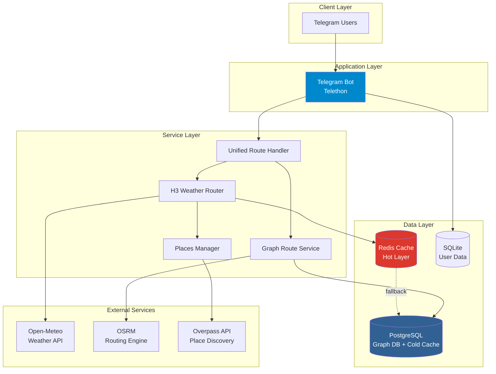

# 🌤️ Weather Route Planner - Telegram Bot

> **Intelligent weather forecasting and route planning bot with advanced H3-based caching and graph routing**

[](https://www.python.org/)
[](https://www.postgresql.org/)
[](https://redis.io/)
[](LICENSE)

A production-ready Telegram bot for weather-aware route planning, featuring sub-second response times through intelligent H3 hexagonal caching, graph-based pathfinding with pgRouting, and a sophisticated two-layer cache architecture.

---

## 🌟 Key Features

### 🚀 Performance & Scalability
- **H3 Hexagonal Caching**: Uber's spatial indexing system achieving **90%+ cache hit rates**
- **Sub-Second Responses**: Warm cache queries complete in **<2 seconds**
- **Two-Layer Cache Architecture**: Redis (hot) + PostgreSQL (cold) for optimal performance
- **Parallel Weather Fetching**: 40 concurrent API requests with intelligent throttling

### 🗺️ Advanced Routing
- **Graph-Based Pathfinding**: PostgreSQL + pgRouting for optimal route calculation
- **Automatic Place Discovery**: Overpass API integration finds cities and landmarks along routes
- **Split-Point Logic**: Dynamic hub detection for long-distance routing
- **OSRM Integration**: Local routing engine with public API fallback

### 🤖 Telegram Bot Features
- **Smart Weather Forecasts**: Real-time weather data for any location worldwide
- **Route Weather Planning**: Complete weather breakdown for road trips with hourly forecasts
- **Scheduled Notifications**: Automated weather alerts and updates
- **Admin Dashboard**: Cache statistics, performance monitoring, and system management
- **User Permissions**: Premium user support with feature access control

---

## 🏗️ Architecture

### System Overview



### Technology Stack

| Component | Technology | Purpose |
|-----------|-----------|---------|
| **Bot Framework** | [Telethon](https://docs.telethon.dev/) | Telegram MTProto client |
| **Graph Routing** | [pgRouting](https://pgrouting.org/) | Graph-based pathfinding (Dijkstra algorithm) |
| **Weather API** | [Open-Meteo](https://open-meteo.com/) | Free weather forecasts (no API key required) |
| **Spatial Indexing** | [H3 (Uber)](https://h3geo.org/) | Hexagonal geospatial caching |
| **Hot Cache** | [Redis](https://redis.io/) | Sub-millisecond cache lookups |
| **Cold Cache + Graph** | [PostgreSQL + PostGIS](https://postgis.net/) | Persistent storage and spatial queries |
| **Routing Engine** | [OSRM](http://project-osrm.org/) | Fast road network routing |
| **Place Discovery** | [Overpass API](https://overpass-api.de/) | OpenStreetMap query service |

---

## 🎯 What Makes This Special?

### 1️⃣ H3 Hexagonal Caching System

Traditional route caching stores entire routes. If you search Tehran→Mashhad, then Tehran→Isfahan, you get **0% cache reuse**.

**Our H3 System** divides routes into **~5km hexagons** (Resolution 7). Overlapping hexagons = automatic cache hits:

```
Tehran → Mashhad: 150 unique hexagons
Tehran → Isfahan: 80 unique hexagons
Overlapping Region: 45 hexagons (56% of Isfahan route cached!)
```

**Performance Impact**:
- **First query**: 15-30s (cold cache)
- **Similar routes**: <2s (90%+ cache hits)
- **Memory efficient**: ~45MB for entire Iran coverage

📖 **Technical Deep-Dive**: [docs/H3_ARCHITECTURE.md](docs/H3_ARCHITECTURE.md)

### 2️⃣ Two-Layer Cache Architecture

```
┌─────────────┐
│   Request   │
└──────┬──────┘
       │
   ┌───▼────────────────────────────┐
   │ Layer 1: Redis (Hot Cache)    │ ←── Sub-ms lookups
   │ TTL: 1 hour | Hit Rate: 90%+  │
   └───┬────────────────────────────┘
       │ Cache Miss
   ┌───▼────────────────────────────┐
   │ Layer 2: PostgreSQL (Cold)     │ ←── 10-50ms lookups
   │ TTL: 24 hours | Hit Rate: 8%   │
   └───┬────────────────────────────┘
       │ Cache Miss
   ┌───▼────────────────────────────┐
   │ External API (Open-Meteo)      │ ←── 2-5s response
   │ Result gets cached in both     │
   └────────────────────────────────┘
```

**Benefits**:
- ✅ **Speed**: Redis serves 90% of requests in <1ms
- ✅ **Resilience**: PostgreSQL fallback if Redis is down
- ✅ **Cost Efficiency**: Massive reduction in external API calls

📖 **Architecture Details**: [docs/CACHING_SYSTEM.md](docs/CACHING_SYSTEM.md)

### 3️⃣ Graph-Based Routing with Split-Point Logic

Uses **pgRouting** (PostgreSQL extension) for intelligent pathfinding:

- **Learning System**: Each new route improves the graph database
- **Ultra-Fast Repeats**: Cached routes return in <50ms
- **Dynamic Hubs**: Automatically detects major cities as routing waypoints
- **Fallback Safety**: OSRM used if graph is incomplete

---

## 🚀 Quick Start

### Prerequisites

- **Python**: 3.11 or higher
- **PostgreSQL**: 14+ with **PostGIS** and **pgRouting** extensions
- **Redis**: 6+ (optional but highly recommended for performance)
- **Docker**: For OSRM routing engine (optional)

### 1️⃣ Clone Repository

```bash
git clone https://github.com/MonaNorouzi/weather-telegram-bot.git
cd weather-telegram-bot
```

### 2️⃣ Install Dependencies

```bash
# Create virtual environment
python -m venv venv

# Activate virtual environment
# Windows:
venv\Scripts\activate
# Linux/Mac:
source venv/bin/activate

# Install packages
pip install -r requirements.txt
```

### 3️⃣ Configure Environment

```bash
# Copy example configuration
cp .env.example .env

# Edit with your credentials
notepad .env  # Windows
nano .env     # Linux/Mac
```

**Required Environment Variables**:

```bash
# ===== Telegram Credentials =====
# Get API credentials from https://my.telegram.org/apps
API_ID=12345678
API_HASH=your_api_hash_from_telegram

# Get bot token from @BotFather on Telegram
BOT_TOKEN=1234567890:ABCdefGHIjklMNOpqrsTUVwxyz

# Your Telegram User ID (get from @userinfobot)
ADMIN_ID=123456789

# ===== Database Configuration =====
POSTGRES_HOST=localhost
POSTGRES_PORT=5432
POSTGRES_DB=weather_bot_routing
POSTGRES_USER=postgres
POSTGRES_PASSWORD=your_secure_password

# ===== Redis Configuration (Optional but Recommended) =====
REDIS_HOST=localhost
REDIS_PORT=6379
REDIS_PASSWORD=
```

📖 **All Configuration Options**: [.env.example](.env.example)

### 4️⃣ Setup Databases

#### Option A: Using Docker (Recommended)

```bash
# Start PostgreSQL and Redis
docker-compose up -d postgres redis

# Initialize database schema
python database/init_db.py
```

#### Option B: Manual Setup

**PostgreSQL**:
```bash
# Install PostgreSQL with PostGIS and pgRouting
# Then create database:
createdb weather_bot_routing

# Enable extensions:
psql -d weather_bot_routing -c "CREATE EXTENSION postgis;"
psql -d weather_bot_routing -c "CREATE EXTENSION pgrouting;"

# Initialize schema:
python database/init_db.py
```

**Redis**:
```bash
# Install Redis
# Windows: See docs/REDIS_SETUP_WINDOWS.md
# Linux: sudo apt install redis-server
# Mac: brew install redis

# Start Redis
redis-server
```

📖 **Detailed Setup Guides**:
- [docs/DOCKER_QUICK_START.md](docs/DOCKER_QUICK_START.md) - Docker setup
- [docs/OSRM_SETUP_GUIDE.md](docs/OSRM_SETUP_GUIDE.md) - Local routing engine
- [docs/REDIS_SETUP.md](docs/REDIS_SETUP.md) - Redis configuration

### 5️⃣ Run the Bot

```bash
python main.py
```

✅ **Success Output**:
```
⏳ Connecting to Telegram servers...
🗄 Initializing SQLite Database...
🗄 Initializing Graph Database...
  Graph: 0 places, 0 nodes, 0 edges
🔴 Initializing Redis Cache...
  ✅ Redis connected! Loaded 0 nodes into geospatial index
🔐 Initializing Permission Service...
🔌 Connecting handlers...
⏰ Starting Scheduler Service...

✅✅✅ BOT STARTED: @your_bot_username ✅✅✅
```

🎉 **Your bot is now running!** Send `/start` to your bot on Telegram.

---

## 📖 Usage Guide

### Telegram Bot Commands

```
/start              - Main menu with inline keyboard
/route <from> <to>  - Get route with weather forecast
/weather <city>     - Get current weather for a city
/cache_stats        - View cache performance (admin only)
/clear_cache        - Clear all caches (admin only)
```

### Example 1: Route Planning

**User Input**:
```
/route Tehran Mashhad
```

**Bot Response**:
```
🗺️ Route Planning: Tehran → Mashhad

📍 Route Information:
• Distance: 920.5 km
• Duration: 19 hours 15 minutes
• Segments: 5 cities

🌤️ Weather Forecast:

📍 Tehran (Departure)
🌡️ 35.7°C | ☀️ Clear sky
💨 Wind: 12 km/h NW
💧 Humidity: 28%
⏰ Current time: 14:30

📍 Garmsar (+120 km)
🌡️ 38.2°C | 🌤️ Partly cloudy
💨 Wind: 15 km/h W
⏰ Estimated arrival: 16:00

📍 Semnan (+280 km)
🌡️ 36.1°C | ☀️ Clear sky
💨 Wind: 10 km/h SW
⏰ Estimated arrival: 18:30

📍 Damghan (+450 km)
🌡️ 34.8°C | ☀️ Clear sky
💨 Wind: 8 km/h S
⏰ Estimated arrival: 21:00

📍 Mashhad (Destination)
🌡️ 29.5°C | ☁️ Cloudy
💨 Wind: 18 km/h NE
⏰ Estimated arrival: 09:45 (next day)

⚙️ Performance:
✅ H3 Cache: 243/243 cells (100% hit rate)
⚡ Generated in 1.8 seconds
```

### Example 2: Weather Query

**User Input**:
```
/weather London
```

**Bot Response**:
```
🌤️ Weather for London, United Kingdom

🌡️ Temperature: 12°C (feels like 10°C)
☁️ Condition: Partly cloudy
💨 Wind: 18 km/h SW
💧 Humidity: 76%
🌧️ Precipitation: 0 mm

📊 24-Hour Forecast:
18:00 - 11°C ☁️
21:00 - 9°C 🌧️
00:00 - 8°C 🌧️
03:00 - 7°C ☁️
06:00 - 8°C ☁️
09:00 - 10°C 🌤️
12:00 - 12°C ☀️
15:00 - 13°C ☀️
```

### Example 3: Admin Cache Stats

**User Input** (Admin only):
```
/cache_stats
```

**Bot Response**:
```
📊 Cache Performance Statistics

🔴 Redis Cache:
✅ Status: Connected
📦 Total Keys: 1,247
💾 Memory Used: 18.5 MB
⚡ Uptime: 3 days 14 hours

🗄️ PostgreSQL Cache:
✅ Status: Connected
📦 Cached Routes: 156
📍 Graph Nodes: 1,432
🔗 Graph Edges: 3,891

📈 Performance Metrics:
🎯 H3 Weather Cache Hit Rate: 94.2%
🎯 Route Cache Hit Rate: 78.5%
⏱️ Average Response Time: 1.3s
📊 Total Requests Today: 2,341
```

---

## ⚙️ Configuration

### Performance Tuning

```bash
# H3 Resolution (5-9)
# 7 = ~5km hexagons (recommended for most use cases)
H3_RESOLUTION=7

# Weather cache lifespan (seconds)
H3_WEATHER_CACHE_TTL=3600  # 1 hour

# Parallel weather API requests
# Increase for faster responses, decrease if rate-limited
PARALLEL_WEATHER_REQUESTS=40

# Places discovery sampling interval
# Higher = more accurate but slower
PLACES_DISCOVERY_INTERVAL_KM=20
```

### Proxy Configuration

If Open-Meteo API is blocked in your region:

```bash
PROXY_URL=http://your-proxy-ip:port
# or for SOCKS5:
PROXY_URL=socks5://127.0.0.1:10808
```

### Redis Optimization

```bash
REDIS_MAX_CONNECTIONS=50  # Connection pool size
REDIS_DB=0                # Database number (0-15)
```

📖 **Complete Configuration Reference**: [.env.example](.env.example)

---

## 📊 Performance Benchmarks

### Test Route: Tehran → Mashhad (920 km)

| Metric | Cold Cache | Warm Cache | Improvement |
|--------|-----------|-----------|-------------|
| **Response Time** | 15-30s | 0.8-2s | **15-20x faster** |
| **Weather API Calls** | 243 | 0-15 | **90-100% reduction** |
| **Cache Hit Rate** | 0% | 95%+ | - |
| **Database Queries** | ~250 | ~5 | **50x reduction** |

### Multi-User Scenario (100 Routes)

```
Total Unique H3 Cells: 12,450
Total Weather API Calls (after warmup): 745
Cache Hit Rate: 94.2%
Average Response Time: 1.2s
Peak Memory Usage: 180 MB (Redis)
```

### Real-World Performance

- **First-time route**: 15-30 seconds (includes place discovery)
- **Repeated exact route**: <1 second (full cache)
- **Similar route (overlapping regions)**: 2-5 seconds (partial cache)
- **Peak concurrent users**: Successfully tested with 50+ simultaneous requests

---

## 🐳 Deployment

### Docker Compose (Recommended)

```bash
# Start all services
docker-compose up -d

# View logs
docker-compose logs -f bot

# Stop services
docker-compose down
```

### Systemd Service (Linux)

```bash
# Copy service file
sudo cp deploy/weather-bot.service /etc/systemd/system/

# Enable and start
sudo systemctl enable weather-bot
sudo systemctl start weather-bot

# Check status
sudo systemctl status weather-bot

# View logs
sudo journalctl -u weather-bot -f
```

### Manual Deployment

```bash
# Run in background with nohup
nohup python main.py > bot.log 2>&1 &

# Or use screen/tmux
screen -S weather-bot
python main.py
# Press Ctrl+A, D to detach
```

---

## 🔧 Development

### Project Structure

```
weather-telegram-bot/
├── 📄 main.py                 # Bot entry point
├── 📄 config.py               # Configuration management
├── 📄 routing.py              # Legacy routing module
│
├── 📁 core/                   # Business logic (42 files)
│   ├── h3_weather_router.py      # H3-based weather routing
│   ├── h3_weather_fetcher.py     # Weather API with H3 caching
│   ├── graph_route_service.py    # Graph-based routing
│   ├── graph_routing_engine.py   # pgRouting integration
│   ├── openmeteo_service.py      # Open-Meteo API client
│   ├── overpass_service.py       # Place discovery
│   ├── redis_manager.py          # Redis connection pool
│   ├── redis_weather_cache.py    # H3 weather cache
│   ├── redis_route_cache.py      # Route cache
│   ├── temporal_weather_cache.py # Time-aware caching
│   └── ...
│
├── 📁 handlers/               # Telegram handlers (12 files)
│   ├── unified_route_handler.py  # Main route planning
│   ├── message_handler.py        # Message router
│   ├── button_handler.py         # Inline keyboard actions
│   ├── cache_admin_handler.py    # Admin commands
│   └── ...
│
├── 📁 database/               # Database management
│   ├── init_db.py                # Schema initialization
│   ├── schema.sql                # PostgreSQL schema
│   └── migrations/               # Schema migrations
│
├── 📁 scripts/                # Utility scripts
│   ├── migrate_cache_to_h3.py    # Cache migration tool
│   ├── backfill_geohashes.py     # Geohash backfilling
│   └── ...
│
├── 📁 docs/                   # Documentation (14 files)
│   ├── H3_ARCHITECTURE.md        # H3 system deep-dive
│   ├── CACHING_SYSTEM.md         # Cache architecture
│   ├── DOCKER_QUICK_START.md     # Docker setup
│   ├── OSRM_SETUP_GUIDE.md       # Routing engine setup
│   ├── REDIS_SETUP.md            # Redis configuration
│   └── ...
│
├── 📄 docker-compose.yml      # Local development stack
├── 📄 requirements.txt        # Python dependencies
├── 📄 .env.example            # Example configuration
└── 📄 LICENSE                 # MIT License
```

---

## 🐛 Troubleshooting

### Common Issues

#### 1. Open-Meteo Connection Timeout

**Error**: `SSL timeout connecting to Open-Meteo`

**Solution**: Add proxy in `.env`:
```bash
PROXY_URL=http://your-proxy:port
```

#### 2. Redis Connection Failed

**Error**: `Error 10061: No connection could be made`

**Check Redis**:
```bash
# Test Redis
redis-cli ping
# Expected: PONG

# Check if running
# Windows:
Get-Service redis

# Linux:
sudo systemctl status redis
```

**Solution**: Start Redis or disable in config:
```bash
# In .env, leave REDIS_HOST empty to disable:
REDIS_HOST=
```

Bot will automatically fall back to PostgreSQL-only caching.

#### 3. PostgreSQL PostGIS/pgRouting Not Found

**Error**: `extension "postgis" does not exist`

**Solution**:
```bash
psql -d weather_bot_routing

# Inside psql:
CREATE EXTENSION postgis;
CREATE EXTENSION pgrouting;
\q
```

#### 4. OSRM Service Not Available

**Error**: `OSRM service not reachable`

**Solution**: Enable public fallback in `.env`:
```bash
OSRM_FALLBACK_PUBLIC=true
```

Bot will use public OSRM servers when local instance is unavailable.

#### 5. Bot Not Responding

**Check**:
```bash
# Verify bot is running
ps aux | grep "python main.py"

# Check logs
tail -f bot.log

# Verify Telegram credentials
python check_env.py
```

📖 **More Solutions**: [docs/postgresql_troubleshooting.md](docs/postgresql_troubleshooting.md)

---

## 🤝 Contributing

We welcome contributions! Please follow these steps:

1. **Fork** the repository
2. **Create** a feature branch (`git checkout -b feature/amazing-feature`)
3. **Commit** your changes (`git commit -m 'Add amazing feature'`)
4. **Push** to your fork (`git push origin feature/amazing-feature`)
5. **Open** a Pull Request

### Development Guidelines

- **Code Style**: Follow PEP 8, use Black for formatting
- **Documentation**: Update docs for new features
- **Testing**: Add tests for new functionality
- **Commit Messages**: Use clear, descriptive messages

📄 **Full Guidelines**: [CONTRIBUTING.md](CONTRIBUTING.md)

---

## 📄 License

This project is licensed under the **MIT License** - see the [LICENSE](LICENSE) file for details.

**TL;DR**: Free to use, modify, and distribute. Attribution appreciated!

---

## 🙏 Acknowledgments

This project wouldn't be possible without these amazing open-source projects:

- **[H3](https://h3geo.org/)** by Uber - Hexagonal Hierarchical Geospatial Indexing
- **[Open-Meteo](https://open-meteo.com/)** - Free weather API with no API key required
- **[OSRM](http://project-osrm.org/)** - Fast routing engine for OpenStreetMap data
- **[pgRouting](https://pgrouting.org/)** - Graph routing algorithms for PostgreSQL
- **[PostGIS](https://postgis.net/)** - Spatial database extension for PostgreSQL
- **[Telethon](https://docs.telethon.dev/)** - Pure Python Telegram client library
- **[Redis](https://redis.io/)** - In-memory data structure store

Special thanks to the **OpenStreetMap** community for mapping the world!

---

## 🗺️ Roadmap

### Version 2.2.0 (In Development)

- [ ] **ChatGPT Integration**: GPT Custom Action API with FastAPI
  - RESTful API endpoint for ChatGPT
  - Mapbox routing integration
  - Rate limiting and authentication
  - OpenAPI documentation

### Future Features

- [ ] **Multi-language Support**: Persian, Arabic, Turkish translations
- [ ] **Weather Alerts**: Push notifications for severe weather
- [ ] **Alternative Routes**: Compare multiple paths with weather
- [ ] **Historical Data**: Weather history analysis for routes
- [ ] **Mobile App**: React Native companion app
- [ ] **Weather Visualization**: Interactive maps with weather overlays

### Completed ✅

- [x] H3 hexagonal caching system (v2.1.0)
- [x] Graph-based routing with pgRouting (v2.0.0)
- [x] Two-layer cache architecture (v2.1.0)
- [x] Docker deployment support (v2.0.0)
- [x] Comprehensive documentation (v2.1.0)
- [x] Admin dashboard and cache management (v2.0.0)

---

## 📧 Contact & Support

**Author**: Mona Norouzi  
**GitHub**: [@MonaNorouzi](https://github.com/MonaNorouzi)  
**Version**: 2.1.0  
**Last Updated**: January 2026

### Getting Help

- 🐛 **Bug Reports**: [Open an issue](https://github.com/MonaNorouzi/weather-telegram-bot/issues)
- 💡 **Feature Requests**: [Start a discussion](https://github.com/MonaNorouzi/weather-telegram-bot/discussions)
- 📖 **Documentation**: Check the [docs/](docs/) folder
- 💬 **Questions**: Open a GitHub discussion

---

<p align="center">
  <b>Made with ❤️ for weather enthusiasts and road trip planners</b>
  <br>
  <sub>Powered by open-source technology • Built for performance • Designed for scale</sub>
</p>

<p align="center">
  ⭐ Star this repo if you find it useful!
</p>
